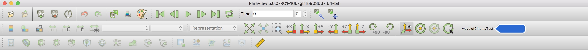
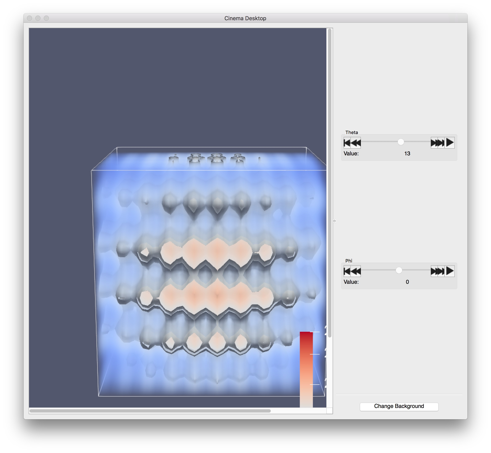
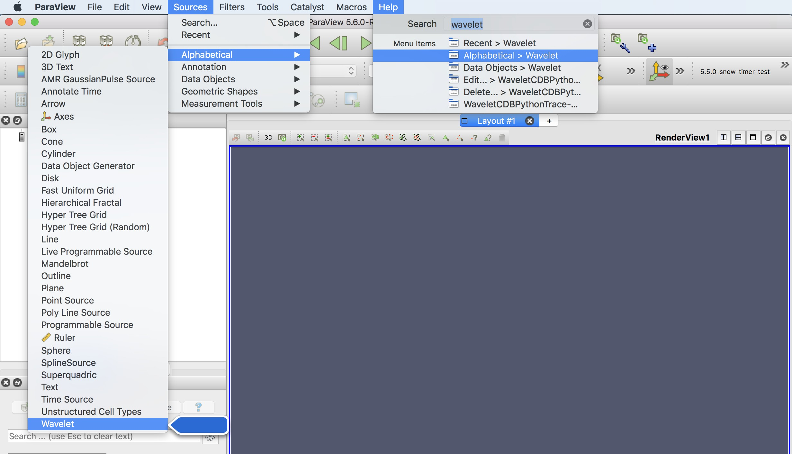
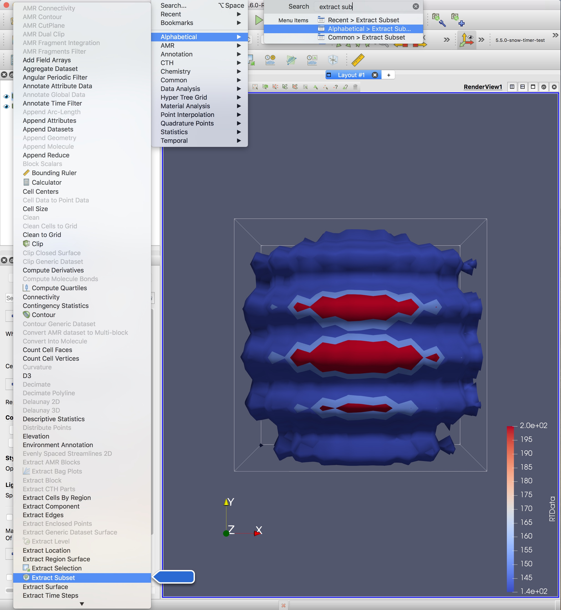
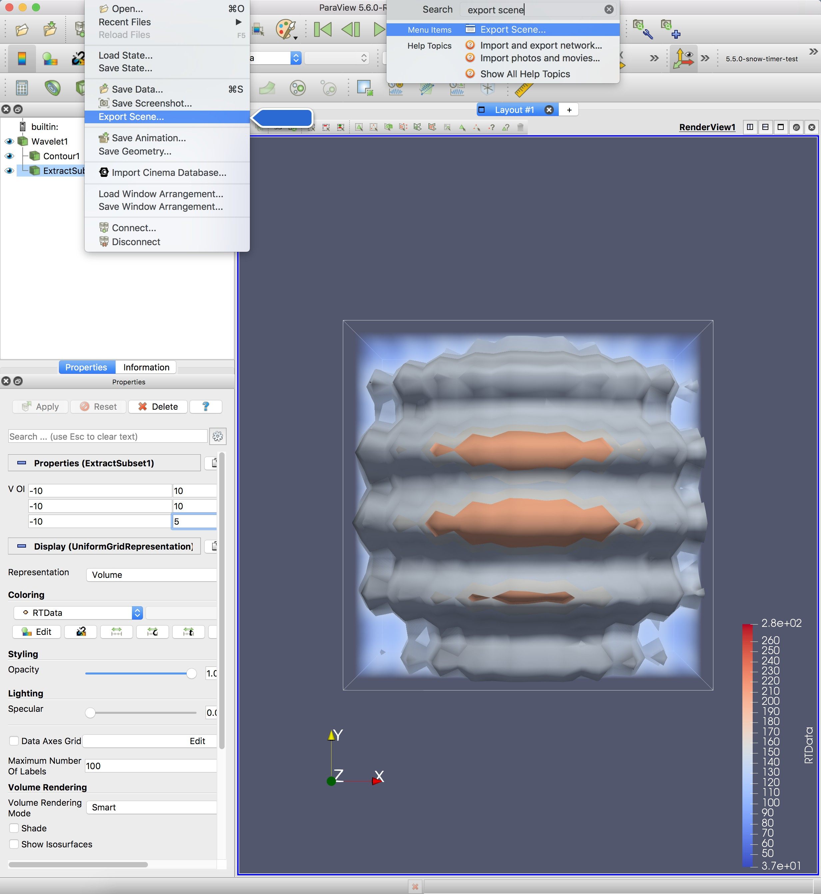
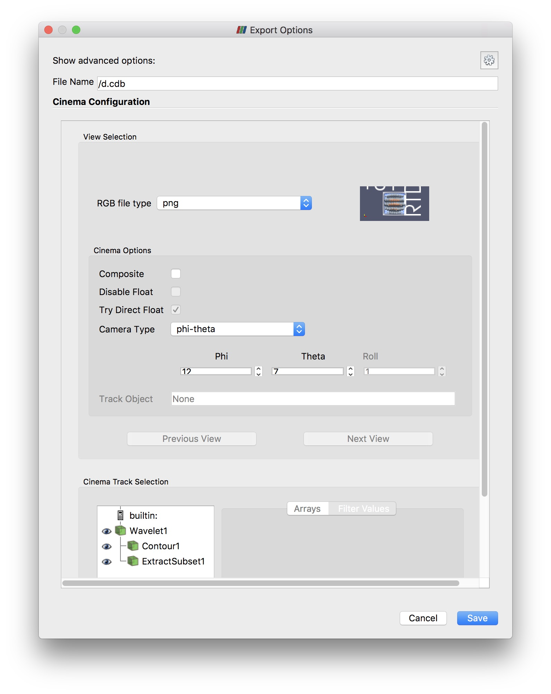

Cinema GUI test plan for a cinema export
----------------------------------------

| Using the Macro (Easiest to reproduce)                 |
|-----------------------------|
|1. Edit waveletCinemaTest.py  - Change line 80 to a file path of your choice|
|2. Start a fresh ParaView|
|3. Add waveletCinemaTest.py as a new macro (This only needs to be done once. ParaView retains macros)  - Top menu -> Macros -> Add new macro... -> select waveletCinemaTest.py    |
|4. Run the macro  - Macros -> waveletCinemaTest.py ... Or select the macro on your toolbar     |
|5. The render view should look something like this when finished:    |
|6. Open cinema and view the newly saved cdb  - File -> Open file-name.cdb  - Cinema on initial load should look like this:    - Rotate along theta, rotate along phi. Everything should look right  |

| Without the Macro (Nice for seeing what the macro does)            |
|-----------------------------|
|1. Start a fresh ParaView    |
|2. Create a 403 wavelet source:  - Sources -> Alphabetical -> Wavelet    - Change extents to -20 to 20 -> Apply   |
|3. Apply 3 contour levels:  - Select Wavelet1 in the Pipeline Browser -> Filters -> Alphabetical -> Contour    - Contour at RTData of 140, 150, and 200. Check the "Compute Scalars" box -> Apply    |
|4. Extract a subset and volume render it:  - Select Wavelet1 in the Pipeline Browser -> Filters -> Alphabetical -> Extract Subset    - Change Z extent to -20 to 10 -> Apply      |
|5. Export CDB:  - File -> Export Scene    - Choose file name and location -> ok  - Cinema Options: Uncheck composite, and set Camera Type to phi-theta, Save    |
|4. After exporting, ParaView should look like this:    |
|5. Open cinema and view the newly saved cdb  - File -> Open file-name.cdb   - Compare first screen with this screenshot:    - Rotate along theta, rotate along phi. Everything should look right  |